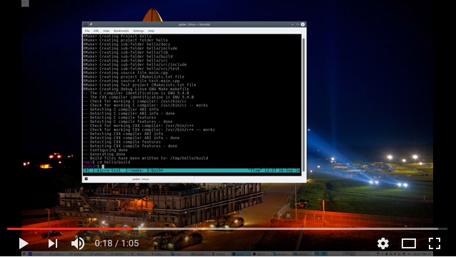

# RMAKE - Rapid Testable C++ Project Creator

## Description

RMake is a command line utility for creating C++ projects using [CMake](https://cmake.org/). It also creates a Test sub-project using [Micro Test](https://bitbucket.org/rajinder_yadav/micro_test).

To use the **rmake** Ruby script

1. On Linux add the following alias to your **~/.bachrc** file (of course your path will be different).

    ```bash
    alias rmake='~/dev/rmake/rmake.rb'
    ```

    **Note**: I have rmake installed under my User path: ~/dev/rmake/

1. On Windows you will need to edit the **PATH** environment variable and add the folder path to where rmake.rb is located.

## Basic Usage

Let's go through the steps of creating a simple "hello" project using rmake.

1. Project "hello" Creation, project is created under folder 'hello'.

    ```bash
    cd /tmp

    rmake hello
    ```

1. Building project, Makefile is located under sub-folder build.

    ```bash
    cd hello/build

    make
    ```

1. Running hello program.

    ```bash
    ./hello
    ```

1. Running test program. Initially one failing test is created for you to follow.

    ```bash
    ./test/test.hello
    ```

## Watch Video

[](https://www.youtube.com/watch?v=OQskZ0Z5uqA)

## Micro Test - Testing Your Project
RMake creates a test sub-folder and use the latest Micro Test header file, it basically pull it from the Micro Test Git repository.

To learn more about how to write tests using [Micro Test check out the project site](https://bitbucket.org/rajinder_yadav/micro_test).

---
## Importing Eclipse Project (Linux)

Launch Eclipse, then from the file menu select:

File -> New -> "Make project with existing code"

1. Select Linux GCC for the toochain
1. Browse to the existing project root
1. Click finish

After the project is imported, from eclipse, right-click on the project name and pick "Properties" to bring up the project settings, or use the <Alt+Enter> shortcut.

Next click on "C/C++ Builds"

1. Uncheck use default build command and type: "make VERBOSE=1"
1. Click workspace button and select the folder "build" for this project
1. Click OK

Next expand on "C/C++ General" and select "Path & Symbols"

1. Click on the "Source Location" tab
1. Click "Add Folder" button and select folder "src"
1. Click OK

You should now be able to build and debug your C++ project.


## Importing the Eclipse project (Windows & VC++)

Now we import our project into Eclipse.
Launch Eclipse and from the file menu select:

File -> New -> "Make project with existing code"

1. Select "Microsoft Visual C++" for the toochain
1. browse to the existing project root
1. click finish

We need to determine where the Include and Lib folder can be found.
To do this from VC++ command prompt type:

```
echo %VSINSTALLDIR%
echo %WindowsSdkDir%
```

Once the project is imported, select it and right-click and pick "Properties" to bring up the project settings, or use the <Alt+Enter> shortcut.

1. Select "C/C++ Build" -> "Settings"
1. Click on "Linker" -> "Libraries"
1. Under "Addtional libpath" click on the "+" icon
1. Enter path to Lib folder, if should be something like

```
"C:\Program Files\Microsoft SDKs\Windows\v7.0A\Lib"
OR
"C:\Program Files\Microsoft Visual Studio 10.0\VC\lib"
```

Next expand on "C/C++ General" and select "Path & Symbols".

1. Click on the "Source Location" tab
1. Click "Add Folder" button and select "src" folder
1. Click OK

We now need to excluse the build folder from the build process.

1. Right click on the build folder
1. Select "Resource Configurations" -> "Exclude from build".
1. Select ALL and click OK

You should be able to build and run your project.

---
Rajinder Yadav <info@devmentor.org>

Lab DevMentor.org Corp.

### Thank you for using RMake, your support is very appreciated!
### Happy Hacking =)
